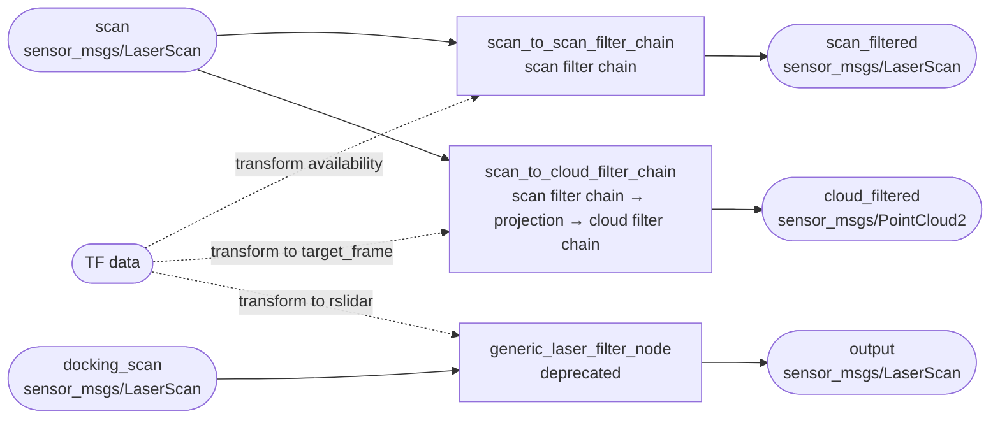

# `laser_filters`

`laser_filters` is a ROS 2 package of pluginlib filters and ready-to-run filter-chain nodes for processing planar laser scans.

## Table of contents

- [Overview](#overview)
- [Installation & Build](#installation--build)
- [Nodes / Executables](#nodes--executables)
- [Launch Files](#launch-files)
- [Interfaces](#interfaces)
- [Configuration](#configuration)
- [Testing](#testing)
- [Known Issues](#known-issues)
- [Glossary](#glossary)

## Overview

This package supplies a shared library of `filters::FilterBase<sensor_msgs::msg::LaserScan>` plugins, a scan-to-scan chain, a scan-to-`PointCloud2` chain, and a deprecated generic scan filter node. In a larger robot system it normally sits between a lidar driver and downstream perception, localization, mapping, or navigation nodes: it can reject points by angle, range, intensity, mask, box, sector, polygon, footprint, shadow, blob, or speckle criteria; smooth scans; interpolate invalid readings; and optionally project a filtered scan into a point cloud. The package does not contain a lidar driver or define messages of its own.

| Property | Value |
|---|---|
| Package version | `2.0.9` (`package.xml:7`) |
| Build type | `ament_cmake`, using `ament_cmake_auto` (`package.xml:33`, `CMakeLists.txt:8-9`) |
| Language | C++ nodes and plugins; Python/XML launch and Python launch tests |
| ROS distro | The source is not pinned to one distro. CI tests ROS 2 Humble and Jazzy (`.github/workflows/ros2_ci.yml`); those are the explicitly supported assumptions visible in this package. |
| License | BSD (`package.xml:11`, `LICENSE`) |

### Dependencies

`<depend>` means both build/export and runtime dependency in package format 3. “Internal” was checked against package names under this workspace's `src/`; none of these dependencies is supplied by the same workspace.

| Name | Declaration type | Internal / external | Use |
|---|---|---|---|
| `ament_cmake_auto` | `build_depend` | External | Finds manifest dependencies, creates/installs targets, and packages share resources. |
| `angles` | `depend` | External | Degree/radian conversion and shadow-filter geometry. |
| `diagnostic_msgs` | `depend` | External | Diagnostic message dependency used through `diagnostic_updater`; no direct include appears in this package. |
| `diagnostic_updater` | `depend` | External | Heartbeat diagnostics in both current filter-chain nodes. |
| `filters` | `depend` | External | `FilterBase`, `FilterChain`, `MultiChannelFilterChain`, mean, and median implementations. |
| `laser_geometry` | `depend` | External | Projects `LaserScan` into `PointCloud2`. |
| `message_filters` | `depend` | External | Sensor-data subscriber used directly and by the TF message filters. |
| `pluginlib` | `depend` | External | Loads and exports filter implementations. |
| `rclcpp` | `depend` | External | Nodes, publishers, parameters, timers, and logging. |
| `rclcpp_lifecycle` | `depend` | External | Base class used by the box, footprint, and polygon filter objects. |
| `rclcpp_components` | `depend` | External | Registers the two current chains as composable nodes and generates executables. |
| `sensor_msgs` | `depend` | External | `sensor_msgs/msg/LaserScan` and `sensor_msgs/msg/PointCloud2`. |
| `tf2` | `depend` | External | TF buffer, exceptions, vector math, and transforms. |
| `tf2_geometry_msgs` | `depend` | External | Transforms polygon points. |
| `tf2_ros` | `depend` | External | TF listeners, buffer integration, timer interface, and message filtering. |
| `tf2_kdl` | `depend` | External | Declared, but no direct use was found in package source. |
| `ament_cmake_gtest` | `test_depend` | External | Builds the four C++ GoogleTest targets. |
| `launch_testing_ament_cmake` | `test_depend` | External | Registers the two ROS 2 launch tests. |

The source also directly includes types from `builtin_interfaces`, `geometry_msgs`, and `rcl_interfaces`, and installed Python launch files import `ament_index_python`, `launch`, and `launch_ros`. These are not declared directly in `package.xml`; see [Known Issues](#known-issues).

### Installed and exported artifacts

| Artifact | Kind | Definition / install behavior |
|---|---|---|
| `laser_scan_filters` | Shared library | Contains all exported laser-scan plugins (`src/laser_scan_filters.cpp`); installed by `ament_auto_package`. |
| `laser_filter_chains` | Shared library | Contains `ScanToScanFilterChain` and `ScanToCloudFilterChain`; installed and exported for components. |
| `scan_to_scan_filter_chain` | Executable + component | Generated by `rclcpp_components_register_node`; component class is `ScanToScanFilterChain`. |
| `scan_to_cloud_filter_chain` | Executable + component | Generated by `rclcpp_components_register_node`; component class is `ScanToCloudFilterChain`. |
| `generic_laser_filter_node` | Executable | Built directly from `src/generic_laser_filter_node.cpp`; deprecated at runtime. |
| `laser_filters_plugins.xml` | pluginlib resource | Exported for the `filters` base package and installed into the package share. |
| `include/laser_filters/*.h` | Public headers | Installed/exported by `ament_cmake_auto` with the library targets. |
| `examples/` | Share directory | Installed in full by `ament_auto_package(INSTALL_TO_SHARE examples test)`. |
| `test/` | Share directory | Installed in full, including active tests and legacy ROS 1 files. |

`cfg/`, `doc/`, `mainpage.dox`, `CHANGELOG.rst`, and the root license are not named in `INSTALL_TO_SHARE`; whether any is copied by implicit packaging beyond standard package metadata is **[UNCLEAR — verify against the generated install manifest]**.

Other repository metadata also records real maintenance choices: `CHANGELOG.rst` identifies `2.0.9` as the current release and its ROS 2 port history; `LICENSE` contains the BSD terms; `.github/workflows/ros2_ci.yml` tests Humble/Jazzy but allows failures; `.travis.yml` retains obsolete ROS 1 Indigo/Jade CI; `.gitignore` ignores editor backups (`*~`) and a source-tree `build` directory; and `doc/node_organization.svg` plus `mainpage.dox` are historical ROS 1-era documentation.

## Installation & Build

From the ROS 2 workspace root:

```bash
source /opt/ros/<distro>/setup.bash
rosdep install --from-paths src/sensors/laser_filters --ignore-src -r -y
colcon build --packages-select laser_filters
source install/setup.bash
```

To build the test targets explicitly:

```bash
colcon build --packages-select laser_filters --cmake-args -DBUILD_TESTING=ON
```

The repository CI adds only `--event-handlers console_cohesion+`; no package-specific compiler flags are used. One compile-time decision is made automatically: when `rclcpp_VERSION_MAJOR >= 20`, CMake defines `RCLCPP_SUPPORTS_MATCHED_CALLBACKS`, enabling the `lazy_subscription` parameter and matched-subscriber callbacks (`CMakeLists.txt:15-17`).

There is no `rosidl` generation, custom code-generation target, or custom build step. `cfg/SpeckleFilter.cfg` is an unreferenced ROS 1 `dynamic_reconfigure` generator and is not part of the ROS 2 build.

No required external SDK or non-rosdep system package was found. The legacy, unregistered `test/fake_laser.py` would require ROS 1 `rospy`, `roslib`, and the obsolete `Numeric` module; it is not needed for the ROS 2 build or active tests.

## Nodes / Executables

The two supported chains are separate alternatives; they are not normally run together. The diagram includes the deprecated generic executable for completeness.



### `scan_to_scan_filter_chain`

| Item | Value |
|---|---|
| Executable | `scan_to_scan_filter_chain` |
| Source | `src/scan_to_scan_filter_chain.cpp`, `src/scan_to_scan_filter_chain.hpp` |
| Node name | `scan_to_scan_filter_chain` |
| Default namespace | Empty constructor namespace, therefore `/` unless remapped or supplied by a component container |
| Processing | Applies the configured `sensor_msgs::msg::LaserScan` filter chain. Publishes only when `FilterChain::update()` returns true (`src/scan_to_scan_filter_chain.cpp:127-135`). |
| Services / actions | No explicit service server/client or action server/client. Standard `rclcpp::Node` parameter services may be present through `rclcpp`, but are not created explicitly here. |
| Lifecycle | Not a lifecycle node. Some loaded filter objects inherit `LifecycleNode`, but the chain itself does not. |
| Composability | Yes: `RCLCPP_COMPONENTS_REGISTER_NODE(ScanToScanFilterChain)` and component registration in `CMakeLists.txt:33-37`. |

| Direction | Name | Type | QoS | Rate / callback behavior |
|---|---|---|---|---|
| Subscribe | `scan` | `sensor_msgs/msg/LaserScan` | `rmw_qos_profile_sensor_data`: best effort, volatile, keep-last depth 5. If TF gating is enabled, an additional TF message-filter queue of 50 is used. | Input-driven. With no target frame, each scan directly invokes the chain. With a target frame, scans wait for the transform and may be dropped by the TF filter. With lazy mode, subscription exists only while the output has matched subscribers. |
| Publish | `scan_filtered` | `sensor_msgs/msg/LaserScan` | Integer-depth overload `1000`: keep-last depth 1000 with the `rclcpp` default publisher policies (reliable, volatile). | At most once per accepted input scan and only after a successful filter-chain update. |
| Publish | Diagnostic output managed by `diagnostic_updater` | `diagnostic_msgs`-based output | Not set in this package; dependency defaults apply. | Heartbeat task is registered. Exact topic, QoS, and update cadence are **[UNCLEAR — verify for the installed `diagnostic_updater` version]**. |

| Parameter | Type | Default | Description | Mutability |
|---|---|---:|---|---|
| `lazy_subscription` | `bool` | `false` | Subscribe to `scan` only while `scan_filtered` has subscribers. Declared only when built with `rclcpp` major version 20 or newer. | Read-only |
| `tf_message_filter_target_frame` | `string` | `""` | Empty bypasses TF gating; non-empty requires each scan to be transformable into this frame. | Read-only |
| `tf_message_filter_tolerance` | `double` | `0.03` s | Additional tolerance on the TF message filter. | Read-only |
| `filter1`, `filter2`, … | nested filter-chain parameters | None | Ordered plugin definitions at the node's root parameter scope. See the plugin catalog below. | Plugin-dependent |

No callback groups are created. The generated component executable's exact executor comes from the installed `rclcpp_components` implementation and is **[UNCLEAR — verify]**; when composed, the container selects the executor. The node itself does not request a `MultiThreadedExecutor`.

The three fixed node parameters are declared with read-only descriptors, but those descriptors contain no human-readable description; the descriptions above are derived from their use in this package.

### `scan_to_cloud_filter_chain`

| Item | Value |
|---|---|
| Executable | `scan_to_cloud_filter_chain` |
| Source | `src/scan_to_cloud_filter_chain.cpp`, `src/scan_to_cloud_filter_chain.hpp` |
| Node name | `scan_to_cloud_filter_chain` |
| Default namespace | Empty constructor namespace, therefore `/` unless remapped or supplied by a component container |
| Processing | Applies `scan_filter_chain`, optionally changes every range using the incident-angle formula, transforms/projects the scan into `target_frame`, applies `cloud_filter_chain`, and publishes `PointCloud2`. |
| Services / actions | No explicit services or actions. |
| Lifecycle | Not a lifecycle node. |
| Composability | Yes: `RCLCPP_COMPONENTS_REGISTER_NODE(ScanToCloudFilterChain)` and component registration in `CMakeLists.txt:27-31`. |

| Direction | Name | Type | QoS | Rate / callback behavior |
|---|---|---|---|---|
| Subscribe | `scan` | `sensor_msgs/msg/LaserScan` | `rmw_qos_profile_sensor_data`: best effort, volatile, keep-last depth 5; TF message-filter queue 50. | Input-driven after a transform to `target_frame` is available. Lazy behavior is compile-time/version gated as above. |
| Publish | `cloud_filtered` | `sensor_msgs/msg/PointCloud2` | Integer-depth overload `10`: keep-last depth 10 with default publisher policies (reliable, volatile). | At most once per accepted scan. High-fidelity TF exceptions return without publishing. Return values from the two filter-chain `update()` calls are not checked. |
| Publish | Diagnostic output managed by `diagnostic_updater` | `diagnostic_msgs`-based output | Not set here; dependency defaults apply. | Heartbeat registered; exact topic/QoS/cadence **[UNCLEAR — verify]**. |

| Parameter | Type | Default | Description | Mutability |
|---|---|---:|---|---|
| `lazy_subscription` | `bool` | `false` | Subscribe only while `cloud_filtered` has a matched subscriber; present only with `rclcpp >= 20`. | Read-only |
| `high_fidelity` | `bool` | `false` | Uses the projection overload that interpolates transforms across the scan. | Read-only |
| `notifier_tolerance` | `double` | `0.03` s | TF message-filter tolerance. The name is retained from older notifier terminology. | Read-only |
| `target_frame` | `string` | `"base_link"` | Required target frame for TF gating and point-cloud projection. | Read-only |
| `incident_angle_correction` | `bool` | `true` | Adds `0.03 * exp(-abs(sin(angle)))` to every filtered range before projection. The code labels this experimental/hacky. | Read-only |
| `laser_max_range` | `double` | `DBL_MAX` | Maximum range passed to the non-high-fidelity projection overload. | Read-only |
| `scan_filter_chain.filter1`, … | nested parameters | None | Ordered `LaserScan` filter plugins. | Plugin-dependent |
| `cloud_filter_chain.filter1`, … | nested parameters | None | Ordered `PointCloud2` filter plugins supplied by other packages; this package exports no cloud filter. | Plugin-dependent |

No callback groups are created. Standalone executor details are **[UNCLEAR — verify against `rclcpp_components`]**; a component container controls executor selection when composed.

### `generic_laser_filter_node` (deprecated)

| Item | Value |
|---|---|
| Executable | `generic_laser_filter_node` |
| Source | `src/generic_laser_filter_node.cpp` |
| Node name | `scan_filter_node` |
| Default namespace | `/` |
| Processing | TF-gates `docking_scan` against hard-coded frame `rslidar`, runs the root `LaserScan` filter chain, publishes to `output`, and emits a deprecation warning every 5 seconds. |
| Services / actions | No explicit services or actions. |
| Lifecycle / composability | Neither lifecycle-managed nor registered as a component. |
| Threading | Manual single-threaded `spin_some()` loop capped at 200 Hz (`src/generic_laser_filter_node.cpp:117-131`). |

| Direction | Name | Type | QoS | Rate / callback behavior |
|---|---|---|---|---|
| Subscribe | `docking_scan` | `sensor_msgs/msg/LaserScan` | Message-filter subscriber uses `rmw_qos_profile_sensor_data`; TF queue 50 and tolerance 0.03 s. | Calls the filter callback only when a transform to hard-coded `rslidar` is available. |
| Subscribe | `docking_scan` | `sensor_msgs/msg/LaserScan` | Explicit `rclcpp::SensorDataQoS()` (best effort, volatile, keep-last depth 5). | A second no-op callback is created, but its subscription handle is not retained (`src/generic_laser_filter_node.cpp:94-96`), so its effective lifetime/behavior is problematic; see Known Issues. |
| Publish | `output` | `sensor_msgs/msg/LaserScan` | Integer-depth overload `1000`: keep-last depth 1000 with default publisher policies (reliable, volatile). | Once for each TF-accepted input; the filter-chain return value is ignored. |

The node declares no fixed parameters itself. Root-scoped `filter1`, `filter2`, … parameters are consumed by `filters::FilterChain`. The hard-coded input topic and target frame are not parameters.

### Plugin-owned lifecycle nodes

Three filter implementations also construct a `rclcpp_lifecycle::LifecycleNode` as part of each plugin object. They are not installed executables, are not registered components, and define no transition handlers.

| Node name | Plugin(s) and source | Namespace | Explicit ROS entities / behavior |
|---|---|---|---|
| `laser_scan_box_filter` | `LaserScanBoxFilter`, `include/laser_filters/box_filter.h` | `/` by default | Own TF buffer/listener; no explicit application topic/service/action. Projects scans into `box_frame`. |
| `laser_scan_footprint_filter` | `LaserScanFootprintFilter`, `include/laser_filters/footprint_filter.h` | `/` by default | Own TF buffer/listener; no explicit application topic/service/action. Projects into hard-coded `base_link`. |
| `laser_scan_polygon_filter` | Both polygon plugins, `include/laser_filters/polygon_filter.h` | `/` by default | Own TF buffer/listener, `polygon` publisher, and configured footprint subscriber. |

Because these are default-constructed lifecycle nodes, the external `rclcpp_lifecycle` implementation may also create standard lifecycle service endpoints. Their names/QoS, current state, and whether any of these plugin-owned nodes are added to the parent chain's executor are **[UNCLEAR — verify]**. There are no `on_configure`, `on_activate`, `on_deactivate`, `on_cleanup`, `on_shutdown`, or `on_error` overrides in this package, and publishers are ordinary `rclcpp::Publisher` instances rather than lifecycle publishers.

### Exported filter plugins

All plugins below are implemented in `include/laser_filters/`, instantiated through `laser_scan_filters`, and consume/produce `sensor_msgs/msg/LaserScan`. Filter parameters are nested below each chain entry, for example `filter1.params.lower_threshold`. “Runtime callback” means this package implements a parameter-change callback; whether callbacks in non-polygon filters are wired is partly controlled by the external `filters` base implementation.

| Plugin type | Source | Operation | Parameters (`type`, default) | Runtime changes |
|---|---|---|---|---|
| `laser_filters/LaserArrayFilter` | `include/laser_filters/array_filter.h` | Runs separate multi-channel chains over ranges and intensities, reallocating when beam count changes. | `range_filter_chain` and `intensity_filter_chain` nested definitions; no scalar defaults here. | No callback in this class. |
| `laser_filters/LaserScanIntensityFilter` | `include/laser_filters/intensity_filter.h` | Invalidates ranges outside the open intensity interval; can invert and/or rewrite intensity values; optionally prints a histogram. | `lower_threshold` (`double`, `8000`), `upper_threshold` (`double`, `100000`), `disp_histogram` (`int`, `1`), `invert` (`bool`, `false`), `filter_override_range` (`bool`, `true`), `filter_override_intensity` (`bool`, `false`). | Callback implemented for all parameters. |
| `laser_filters/LaserScanRangeFilter` | `include/laser_filters/range_filter.h` | Replaces ranges at/below and at/above thresholds. | `use_message_range_limits` (`bool`, `false`), `lower_replacement_value`/`upper_replacement_value` (`double`, NaN), `lower_threshold` (`double`, `0`), `upper_threshold` (`double`, `100000`). | No callback in this class. |
| `laser_filters/ScanShadowsFilter` | `include/laser_filters/scan_shadows_filter.h` | Detects likely veiling/shadow points geometrically and sets selected ranges to NaN. | Required: `min_angle` (`double`, degrees), `max_angle` (`double`, degrees), `window` (`int`). Optional: `neighbors` (`int`, `0`), `remove_shadow_start_point` (`bool`, `false`). | Callback implemented. |
| `laser_filters/InterpolationFilter` | `include/laser_filters/interpolation_filter.h` | Replaces contiguous readings outside message range limits with the average of surrounding valid values. | None. | N/A |
| `laser_filters/LaserScanAngularBoundsFilter` | `include/laser_filters/angular_bounds_filter.h` | Truncates the scan to beams between the bounds and adjusts angular/time metadata. | Required `lower_angle`, `upper_angle` (`double`, radians). | No callback in this class. |
| `laser_filters/LaserScanAngularBoundsFilterInPlace` | `include/laser_filters/angular_bounds_filter_in_place.h` | Invalidates beams strictly inside the angular bounds without resizing. | Required `lower_angle`, `upper_angle` (`double`, radians); `replace_with_nan` (`bool`, `false`, otherwise uses `range_max + 1`). | No callback in this class. |
| `laser_filters/LaserScanBoxFilter` | `include/laser_filters/box_filter.h` | Projects into `box_frame` and invalidates points inside the 3-D box, or outside it when inverted. | Required `box_frame` (`string`), `min_x/y/z`, `max_x/y/z` (`double`); `invert` (`bool`, `false`). | No callback in this class. |
| `laser_filters/LaserScanMaskFilter` | `include/laser_filters/scan_mask_filter.h` | Sets configured beam indices to NaN, keyed by `LaserScan.header.frame_id`. | Required `masks.<frame_id>` arrays; YAML numeric values are cast to `size_t`. | No callback in this class. |
| `laser_filters/LaserScanMedianSpatialFilter` | `include/laser_filters/median_spatial_filter.h` | Spatial median/majority filter over adjacent beams; even windows are increased by one. | Required `window_size` (`int`, must be positive). | No callback in this class. |
| `laser_filters/LaserMedianFilter` | `include/laser_filters/median_filter.h` | Deprecated temporal multi-channel wrapper; uses one `internal_filter` definition for ranges and intensities. | `internal_filter` nested chain; exact required schema comes from external `filters`. | No callback in this class. |
| `laser_filters/LaserScanFootprintFilter` | `include/laser_filters/footprint_filter.h` | Projects to hard-coded `base_link` and removes points within a square of half-width `inscribed_radius`. | Required `inscribed_radius` (`double`). | No callback in this class. |
| `laser_filters/LaserScanSpeckleFilter` | `include/laser_filters/speckle_filter.h` | Removes short inconsistent runs (`filter_type=0`) or radius outliers (`filter_type=1`). | Required `filter_type` (`int`: 0/1), `max_range` (`double`), `max_range_difference` (`double`), `filter_window` (`int`). | Callback implemented. |
| `laser_filters/ScanBlobFilter` | `include/laser_filters/scan_blob_filter.h` | Keeps only the center beam of sufficiently large contiguous blobs whose estimated radius is below the threshold. | `max_radius` (`double`) and `min_points` (`int`) are effectively required: code seeds `0.1`/`5` but returns false when either lookup fails. | No callback in this class. |
| `laser_filters/LaserScanSectorFilter` | `include/laser_filters/sector_filter.h` | Clears points inside or outside an angular/range sector, writing `range_max + 1`. | Required `angle_min`, `angle_max`, `range_min`, `range_max` (`double`), `clear_inside`, `invert` (`bool`). | No callback in this class. |
| `laser_filters/LaserScanPolygonFilter` | `include/laser_filters/polygon_filter.h` | Dynamically projects scans into `polygon_frame`, publishes the polygon, accepts polygon updates, and removes points inside/outside it. | Required `polygon` (`string` encoded `[[x,y],…]`) and `polygon_frame` (`string`); `footprint_topic` (`string`, `base_footprint_exclude`); `invert` and `polygon_padding` have claimed fallbacks but code initialization is **[UNCLEAR — verify]**. | Callback implemented for polygon/frame/invert/padding. |
| `laser_filters/StaticLaserScanPolygonFilter` | `include/laser_filters/polygon_filter.h` | Transforms the polygon into the first scan frame once, then uses cached sine/cosine projection. Re-transforms after polygon/parameter changes. | Base polygon parameters plus `transform_timeout` (`double`, `5` s). | Callback implemented; invalidates cached transform. |

The polygon variants internally create additional entities on their `LifecycleNode` base:

| Direction | Name | Type | QoS / behavior |
|---|---|---|---|
| Publish | `polygon` | `geometry_msgs/msg/PolygonStamped` | Reliable default, transient local, keep-last depth 1; publishes once after each polygon change. |
| Subscribe | Value of `footprint_topic` | `geometry_msgs/msg/Polygon` | Integer-depth overload 1, therefore keep-last depth 1 with default reliability/durability; accepts polygons with at least three points. |

The box, footprint, and polygon filter classes inherit `rclcpp_lifecycle::LifecycleNode`, but implement no lifecycle transition callbacks and are loaded as filter objects rather than exposed as independently managed lifecycle executables. Their lifecycle state and whether their internally created subscriptions are serviced by the parent chain executor are **[UNCLEAR — verify]**.

## Launch Files

All supported Python/XML examples start one `scan_to_scan_filter_chain`; none declares launch arguments, conditions, namespaces, remappings, respawn behavior, or explicit output policy. Unless noted otherwise, each loads the same-basename YAML from the installed `laser_filters/examples` directory.

### `examples/angular_filter_example.launch.py`

Starts `scan_to_scan_filter_chain` with `angular_filter_example.yaml`, which configures `LaserScanAngularBoundsFilter` for `-1.52` to `1.52` radians.

### `examples/box_filter_example.launch.py`

Starts the chain with `box_filter_example.yaml`: a `LaserScanBoxFilter` in `base_link` with a `[-0.5, 0.5]` m box on all three axes and `invert: false`.

### `examples/footprint_filter_example.launch.py`

Starts the chain with `footprint_filter_example.yaml`: `LaserScanFootprintFilter` with `inscribed_radius: 0.325` m.

### `examples/intensity_filter_example.launch.py`

Starts the chain with `intensity_filter_example.yaml`: intensity thresholds `8000` and `100000`, histogram disabled.

### `examples/mask_filter_example.launch.py`

Starts the chain with `mask_filter_example.yaml`: masks indices `100-104` and `1000-1002` only for scans whose frame ID is `laser`.

### `examples/median_filter_example.launch.py`

Starts the chain with `median_filter_example.yaml`: `LaserArrayFilter` with five-observation `filters/MultiChannelMedianFilterFloat` chains for both ranges and intensities. The nested `unused: 5` values are passed to the external plugin; their purpose is **[UNCLEAR — verify in `filters`]**.

### `examples/median_spatial_filter.launch.py`

Starts the chain with `median_spatial_filter_example.yaml`: first a 31-beam spatial median, then a three-observation temporal median over ranges. No intensity subchain is configured for the `LaserArrayFilter`; behavior is **[UNCLEAR — verify in `filters`]**.

### `examples/median_spatial_filter.launch.xml`

XML equivalent of the Python launch above. It explicitly sets node name `scan_to_scan_filter_chain` and `output="screen"`; it loads `median_spatial_filter_example.yaml` through `<param from="…"/>`.

### `examples/multiple_filters_example.launch.py`

Starts the chain with `multiple_filters_example.yaml`: range/intensity temporal medians, an intensity filter, a shadow filter, then another intensity filter. The shadow filter uses `window: 0`, so its inner comparison loop examines no other beam and cannot mark shadows; this is likely an ineffective example setting.

### `examples/pass_through_example.launch.py`

Starts the chain with `pass_through_example.yaml`. That YAML is an empty file, so no filter definitions are loaded; whether an empty external `FilterChain` configures as pass-through is **[UNCLEAR — verify against the installed `filters` version]**.

### `examples/polygon_filter_example.launch.py`

Starts the chain with `polygon_filter_example.yaml`: dynamic polygon filtering in `base_link`, non-inverted, with updates expected on `base_footprint_exclude`.

### `examples/range_filter_example.launch.py`

Starts the chain with `range_filter_example.yaml`: explicit thresholds `0.5-1.0`, with values below replaced by `-inf` and above by `+inf`.

### `examples/scan_blob_filter_example.launch.py`

Starts the chain with `scan_blob_filter_example.yaml`: `max_radius: 0.25`, `min_points: 6`.

### `examples/sector_filter_example.launch.py`

Starts the chain with `sector_filter_example.yaml`: removes points inside the wrap-around sector from `2.54` to `-2.54` radians and ranges `0.2-2.0` m.

### `examples/shadow_filter_example.launch.py`

Starts the chain with `shadow_filter_example.yaml`: shadow filtering (`10-170` degrees, 20 neighbors, one-beam window), followed by an intensity filter.

### `examples/speckle_filter_example.launch` (legacy ROS 1)

This file uses ROS 1 `<node type=…>`, `<rosparam>`, and `$(find laser_filters)` syntax, and loads a ROS 1-style top-level YAML list. It is installed but is not a ROS 2 launch file and is not expected to work with `ros2 launch` (`examples/speckle_filter_example.launch:1-5`).

## Interfaces

This package defines no `.msg`, `.srv`, or `.action` files and performs no `rosidl` generation.

| Consumed interface | Provider package | Use |
|---|---|---|
| `sensor_msgs/msg/LaserScan` | `sensor_msgs` | Input/output of scan chains and every exported filter. |
| `sensor_msgs/msg/PointCloud2` | `sensor_msgs` | Projection and cloud-chain output. |
| `geometry_msgs/msg/Polygon` | `geometry_msgs` | Runtime polygon/footprint updates. |
| `geometry_msgs/msg/PolygonStamped` | `geometry_msgs` | Latched/transient-local visualization of the active polygon. |
| `geometry_msgs/msg/Point32` | `geometry_msgs` | Footprint/polygon point representation. |
| `geometry_msgs/msg/PointStamped` | `geometry_msgs` | Static polygon transformation. |
| `geometry_msgs/msg/TransformStamped` | `geometry_msgs` | TF lookup result used by the static polygon filter. |
| `builtin_interfaces/msg/Time` | `builtin_interfaces` | Scan/polygon time handling. |
| `rcl_interfaces/msg/SetParametersResult` | `rcl_interfaces` | Dynamic parameter callbacks. |
| Diagnostic message types | `diagnostic_msgs` | Produced indirectly by `diagnostic_updater`; exact message entities are external. |

There are no package-defined services or actions. TF traffic is consumed through `tf2_ros` rather than by direct `create_subscription` calls in this package.

## Configuration

There is no `config/` directory. Runtime examples live under `examples/`, are installed, and are loaded only by their corresponding launch files; neither current executable has a built-in parameter-file path. Filter-chain YAML uses this ROS 2 shape:

```yaml
scan_to_scan_filter_chain:
  ros__parameters:
    filter1:
      name: example
      type: laser_filters/LaserScanRangeFilter
      params:
        lower_threshold: 0.5
        upper_threshold: 1.0
```

| YAML file | Consumer / loading path | Configuration summary |
|---|---|---|
| `examples/angular_filter_example.yaml` | Angular Python launch | One angular-bounds filter. |
| `examples/box_filter_example.yaml` | Box Python launch | One 3-D box filter in `base_link`. |
| `examples/footprint_filter_example.yaml` | Footprint Python launch | One footprint filter. |
| `examples/intensity_filter_example.yaml` | Intensity Python launch | One intensity threshold filter. |
| `examples/mask_filter_example.yaml` | Mask Python launch | Per-frame beam-index mask. |
| `examples/median_filter_example.yaml` | Median Python launch | Range and intensity temporal median subchains. |
| `examples/median_spatial_filter_example.yaml` | Median-spatial Python/XML launches | Spatial median followed by range temporal median. |
| `examples/multiple_filters_example.yaml` | Multiple-filters Python launch | Temporal median plus intensity/shadow/intensity stages. |
| `examples/pass_through_example.yaml` | Pass-through Python launch | Empty file. |
| `examples/polygon_filter_example.yaml` | Polygon Python launch | Dynamic polygon and footprint-update topic. |
| `examples/range_filter_example.yaml` | Range Python launch | Threshold/replacement settings. |
| `examples/scan_blob_filter_example.yaml` | Blob Python launch | Blob radius and point-count settings. |
| `examples/sector_filter_example.yaml` | Sector Python launch | Angular/range sector. |
| `examples/shadow_filter_example.yaml` | Shadow Python launch | Shadow then intensity chain. |
| `examples/speckle_filter_example.yaml` | Legacy ROS 1 launch only | ROS 1-style `scan_filter_chain` list; not valid as a ROS 2 node parameter file. |
| `test/test_scan_filter_chain.yaml` | Passed directly to `test_scan_filter_chain` by CMake | Named configurations for intensity, interpolation, shadow, array, and mask tests; the “bad” configuration is actually syntactically complete. |
| `test/test_polygon_filter.yaml` | Located from installed share by launch test | Polygon in the `laser` frame. |
| `test/test_speckle_filter.yaml` | Located from installed share by launch test | Separate distance and radius-outlier configurations selected by test node names. |

`cfg/SpeckleFilter.cfg` records ROS 1 dynamic-reconfigure defaults (`filter_type: 0`, `max_range: 2.0`, `max_range_difference: 0.4`, `filter_window: 4`) but is neither built nor loaded. Those values are not defaults in the ROS 2 plugin: its four parameters are required by `configure()`.

## Testing

Run all registered tests with:

```bash
colcon test --packages-select laser_filters
colcon test-result --verbose
```

| Test | Kind | Coverage |
|---|---|---|
| `test_scan_filter_chain` (`test/test_scan_filter_chain.cpp`) | C++ GoogleTest with YAML | Filter-chain loading and output for intensity, interpolation, shadow, array/mean, and mask plugins; includes a weak “bad configuration” case. |
| `test_shadow_detector` (`test/test_shadow_detector.cpp`) | C++ GoogleTest | Compares `include/laser_filters/scan_shadow_detector.h` against the original trigonometric formulation across ranges and angle thresholds. |
| `test_speckle_filter` (`test/test_speckle_filter.cpp`) | C++ GoogleTest | Distance-window speckle behavior for isolated/adjacent speckles, peaks, edges, and plateaus. Performance test is compiled only if `ENABLE_PERFORMANCE` is defined, which CMake does not do. |
| `test_scan_shadows_filter` (`test/test_scan_shadows_filter.cpp`) | C++ GoogleTest | No-shadow, discontinuity, forward/backward shadow, neighbor, angle threshold, and angle-increment behavior. Optional performance test is disabled by default. |
| `test/test_polygon_filter.test.py` | ROS 2 launch test | End-to-end `scan` → dynamic polygon filter → `scan_filtered` output in a same-frame setup. |
| `test/test_speckle_filter.test.py` | ROS 2 launch test | Starts distance and radius-outlier nodes, remaps outputs, and checks both results. |

The CMake test block is at `CMakeLists.txt:52-112`. There is no `ament_lint_auto`, format/lint test, scan-to-cloud test, component-container test, lifecycle test, QoS compatibility test, TF-delay/failure launch test, lazy-subscription test, diagnostic test, or test for angular, box, footprint, range, median-spatial, interpolation edge cases, blob, sector, or static polygon behavior. The speckle C++ source explicitly notes that radius-outlier mode has no unit test (`test/test_speckle_filter.cpp:7-10`); only its launch-level observed output is checked.

`test/fake_laser.py` and `test/test_scan_filter_chain.launch` are ROS 1 artifacts and are not registered by CMake. GitHub Actions builds/tests Humble and Jazzy, but the job has `continue-on-error: true`, so a failing matrix job does not necessarily fail the workflow. `.travis.yml` is an obsolete ROS 1 Indigo/Jade configuration.

## Known Issues

### Explicit TODO / HACK / FIXME / XXX comments

No `FIXME` or `XXX` comments were found. Current TODO/HACK comments are:

| Location | Comment / implication |
|---|---|
| `src/scan_to_cloud_filter_chain.cpp:136-137` | `TODO CLEAN UP HACK`: incident-angle correction is a trial that makes non-general assumptions; it is enabled by default. |
| `include/laser_filters/polygon_filter.h:428-429` | Polygon cloud parsing works only with float fields and an `index` field. |
| `include/laser_filters/array_filter.h:98` | Avoid copying the full scan. |
| `include/laser_filters/array_filter.h:109` | Check intensity-array length. |
| `include/laser_filters/array_filter.h:124` | Cache only shallow scan information. |
| `include/laser_filters/median_filter.h:99` | Avoid copying the full scan. |
| `include/laser_filters/median_filter.h:118` | Check intensity-array length. |
| `include/laser_filters/median_filter.h:130` | Cache only shallow scan information. |
| `mainpage.dox:17` | Mean filter documentation missing. |
| `mainpage.dox:20` | Shadow filter documentation missing. |
| `mainpage.dox:23` | Intensity filter documentation missing. |

### Behavior, compatibility, and documentation gaps

- `generic_laser_filter_node` is deprecated (`src/generic_laser_filter_node.cpp:98-103`). It has project-specific hard-coded names (`docking_scan`, `rslidar`, `output`), ignores filter-chain success, declares no way to change the TF target, and creates a no-op subscription without retaining its shared pointer (`src/generic_laser_filter_node.cpp:80-96`). Its member declaration order also constructs `TransformListener tf_` before `Buffer buffer_` even though `tf_` receives `buffer_`; the safety of this is **[UNCLEAR — verify]**.
- `LaserMedianFilter` is deprecated in favor of `LaserArrayFilter` (`include/laser_filters/median_filter.h:53-57`). `LaserScanFootprintFilter` is marked deprecated in the plugin XML (`laser_filters_plugins.xml:75-79`).
- `laser_filters_plugins.xml` declares `LaserScanSpeckleFilter` twice. The first entry has the ROS 1 base string `sensor_msgs::LaserScan` (`laser_filters_plugins.xml:51-56`); the second has the correct ROS 2 base but an unrelated deprecated-footprint description (`laser_filters_plugins.xml:81-85`). Plugin resolution behavior is **[UNCLEAR — verify]**.
- Radius-outlier speckle validation reads `scan.ranges[j]` before checking whether `j` is in bounds (`include/laser_filters/speckle_filter.h:96-102`), which can cause undefined behavior at scan edges. The speckle destructor condition is reversed, so a non-null validator is not deleted (`include/laser_filters/speckle_filter.h:169-175`).
- `LaserScanMaskFilter` skips only indices `> ranges.size()`, not `>=`; an index exactly equal to the size can write out of bounds (`include/laser_filters/scan_mask_filter.h:102-104`).
- The intensity filter loads `disp_histogram` but its runtime callback checks `disp_hist`, so changing the documented parameter at runtime will be treated as unknown and changing `disp_hist` does not recompute `disp_hist_enabled_` (`include/laser_filters/intensity_filter.h:62-71`, `include/laser_filters/intensity_filter.h:153-175`).
- `LaserArrayFilter` allocates range/intensity subchains with `new`, leaves its destructor empty, and allocates replacements after scan-size changes without deleting the previous objects (`include/laser_filters/array_filter.h:53-75`, `include/laser_filters/array_filter.h:100-107`).
- Dynamic polygon filtering logs missing `PointCloud2` fields but continues and indexes the field array using `-1` (`include/laser_filters/polygon_filter.h:404-415`). The polygon parser silently preserves the previous polygon after invalid input. Claimed defaults for `invert` and `polygon_padding` are not explicitly initialized before lookup; their actual missing-parameter values are **[UNCLEAR — verify]**.
- The box, footprint, and polygon filters create separate `LifecycleNode` bases inside filter plugins but provide no lifecycle transitions. In particular, whether the polygon filter's internal subscription is added to/spun by the filter-chain executor is **[UNCLEAR — verify]**.
- The scan subscribers are best-effort sensor-data QoS while output publishers are reliable with large queues (1000 for scan output). This is not inherently incompatible, but consumers expecting best-effort sensor QoS may need explicit QoS compatibility checks, and the large reliable output queue can retain substantial scan data during backpressure.
- Diagnostic topic name, QoS, and update cadence come from the installed `diagnostic_updater` implementation and could not be traced inside this package. Component-generated standalone executor behavior and external `filters` parameter declaration/callback semantics likewise could not be fully documented from this package alone.
- Direct dependencies on `geometry_msgs`, `builtin_interfaces`, and `rcl_interfaces` are absent from `package.xml`. Launch/runtime test imports (`ament_index_python`, `launch`, `launch_ros`, `rclpy`, `pytest`) are also not declared directly. Conversely, `tf2_kdl` has no direct use in this package.
- `examples/speckle_filter_example.launch`, its YAML, `test/fake_laser.py`, `test/test_scan_filter_chain.launch`, `cfg/SpeckleFilter.cfg`, and `.travis.yml` are ROS 1-era paths. They are not active ROS 2 build/test inputs; some are nevertheless installed because the entire `examples/` and `test/` directories are copied.
- `examples/pass_through_example.yaml` is empty. `examples/sector_filter_example.yaml` comments claim defaults, but all six sector parameters are required by the implementation. `examples/multiple_filters_example.yaml` uses an ineffective `window: 0` shadow stage.
- `doc/node_organization.svg` and `mainpage.dox` are historical documentation. The SVG uses ROS 1-era type labels such as `sensor_msgs::LaserScan`, `sensor_msgs::PointCloud`, and parameter-server notation; this README's graph reflects current source instead.
- No closed-source code exists in this package, but exact behavior inside external `filters`, `diagnostic_updater`, `laser_geometry`, TF, and generated `rclcpp_components` executable code could not be traced here. Those limitations are marked **[UNCLEAR — verify]** above.

## Glossary

| Term | Meaning in this package |
|---|---|
| Beam / direction | One indexed range sample in a planar `LaserScan`. |
| Filter chain | Ordered plugin sequence loaded by the external `filters` package; each successful stage feeds the next. |
| `scan_filter_chain` | Parameter prefix for the scan stage inside `scan_to_cloud_filter_chain`; the scan-to-scan node instead uses the root parameter scope. |
| `cloud_filter_chain` | Parameter prefix for `PointCloud2` plugins run after projection. Cloud plugins must come from another package. |
| High fidelity | `laser_geometry` projection mode that accounts for changing transforms across the scan acquisition interval. |
| Lazy subscription | Matched-callback mode that unsubscribes from input when nobody subscribes to output; compiled only with newer `rclcpp`. |
| Message filter | TF-aware queue that releases a sensor message only when the requested transform is available. |
| Pluginlib type | YAML `type` identifier such as `laser_filters/LaserScanRangeFilter`, mapped to a C++ class in `laser_filters_plugins.xml`. |
| Spatial median | Median over neighboring beams within one scan. |
| Temporal / array filter | Per-beam filtering over multiple scans using external multi-channel filters. |
| Veiling / scan shadow | Suspect return near a depth discontinuity, detected from the geometry between neighboring rays. |
| `NaN`, `+inf`, `-inf` | Special range values used by different filters to mark invalid, over-range, or under-range readings. Downstream consumers do not necessarily treat them identically. |
| TF target frame | Coordinate frame in which transform availability is required or points/polygons are evaluated. |
